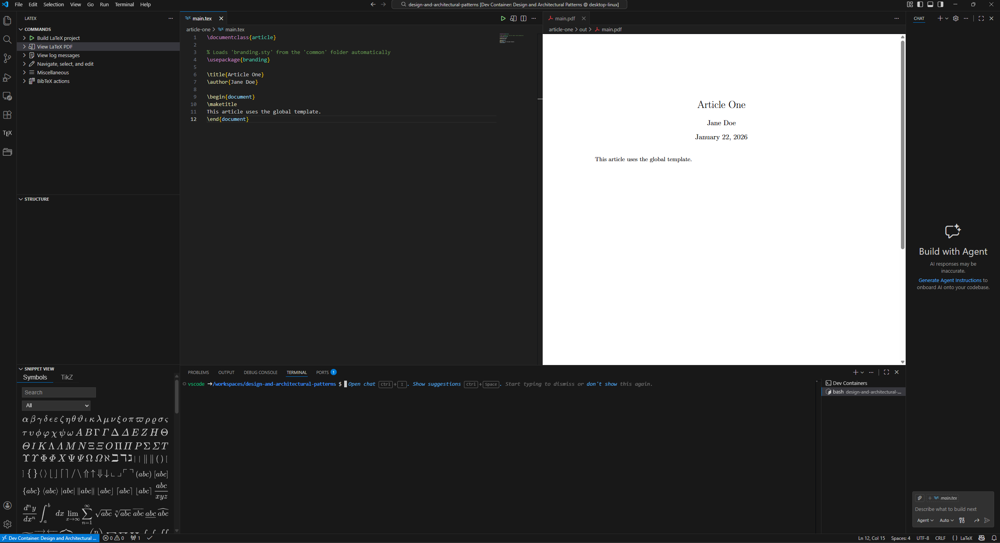

# toolchain-latex

LaTeX development toolchain image for VS Code Dev Containers.

## Includes
- TeX Live (Debian packages)
- `latexmk`
- `biber` + bibtex extras
- common TeX bundles: latex-extra, fonts, pictures, science
- `python3-pygments` (for minted workflows)
- `poppler-utils` / `ghostscript` (PDF utilities)

## ⚠️ Known Limitations
- **Documentation Removed:** To save ~3GB of space, the `texdoc` command and all TeX package documentation have been removed from this image. If you need to read package documentation, please use [CTAN](https://ctan.org) or `texdoc.org`.
- The vscode user has passwordless sudo access. To install missing TeX packages, use: sudo tlmgr install <package_name>

## Image
`ghcr.io/roswellcityuk/dev-toolchains/toolchain-latex`

## Suggested devcontainer.json
```json
{
  "name": "latex",
  "image": "ghcr.io/roswellcityuk/dev-toolchains/toolchain-latex:latest",
  "customizations": {
    "vscode": {
      "extensions": ["james-yu.latex-workshop", "ban.spellright", "valentjn.vscode-ltex"],
      "settings": {
        "latex-workshop.latex.autoBuild.run": "onSave",
        "latex-workshop.latex.outDir": "%DIR%/out",
        "latex-workshop.view.pdf.viewer": "tab"
      }
    }
  },
  "remoteUser": "vscode"
}
```

## Preview


